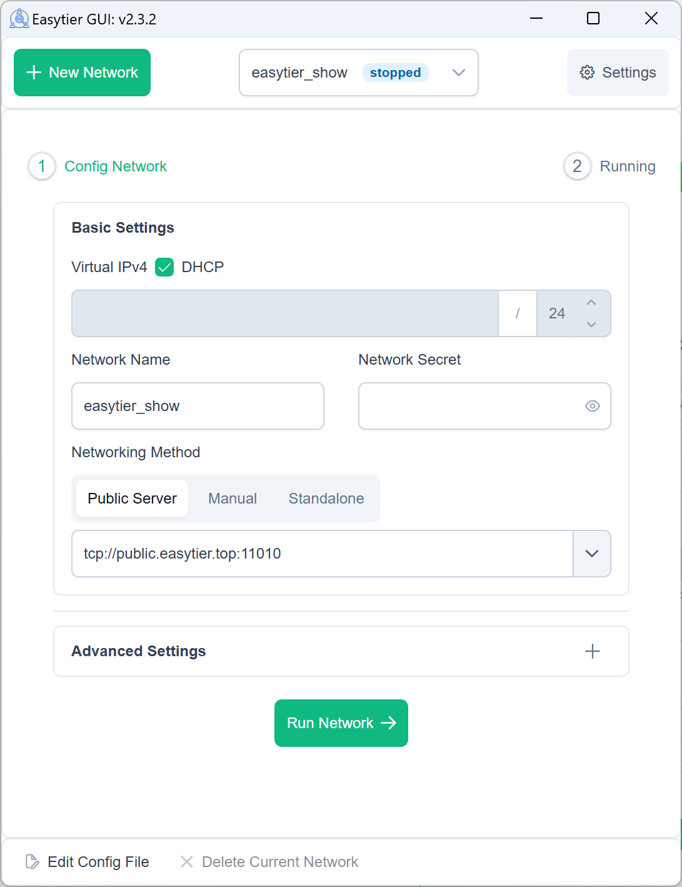
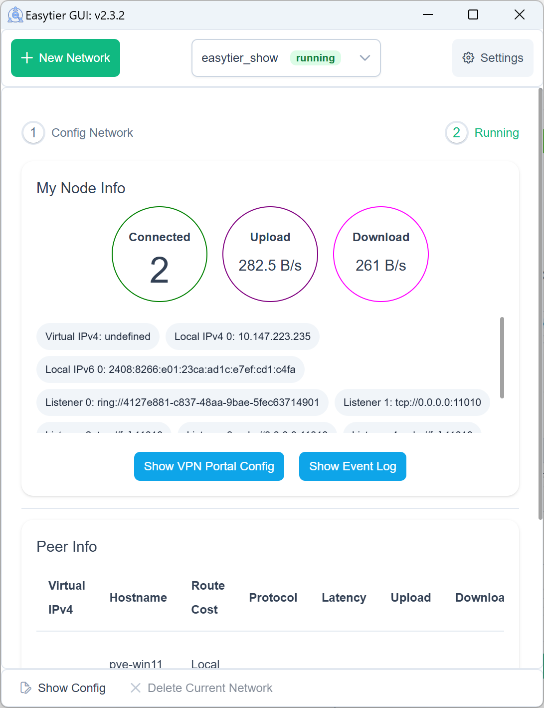
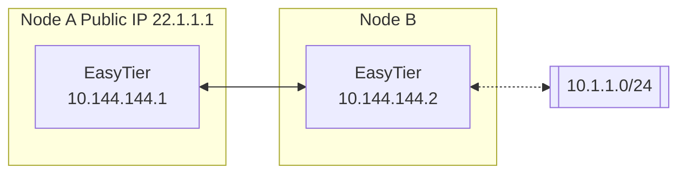
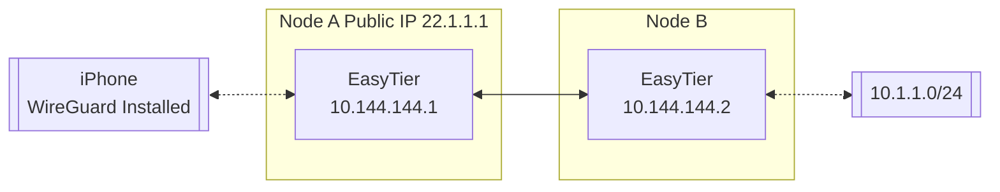
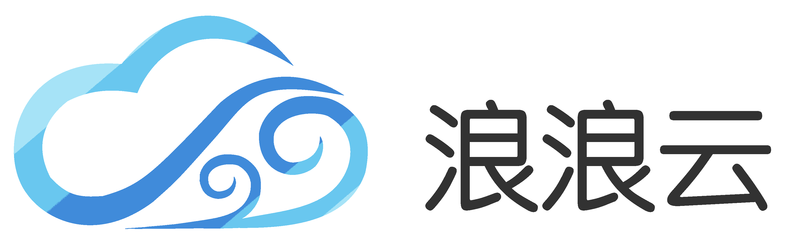

# EasyTier

[](https://github.com/EasyTier/EasyTier/releases)
[](https://github.com/EasyTier/EasyTier/blob/main/LICENSE)
[](https://github.com/EasyTier/EasyTier/commits/main)
[](https://github.com/EasyTier/EasyTier/issues)
[](https://github.com/EasyTier/EasyTier/actions/workflows/core.yml)
[](https://github.com/EasyTier/EasyTier/actions/workflows/gui.yml)
[](https://github.com/EasyTier/EasyTier/actions/workflows/test.yml)
[](https://deepwiki.com/EasyTier/EasyTier)

[简体中文](/README_CN.md) | [English](/README.md)

> ✨ A simple, secure, decentralized virtual private network solution powered by Rust and Tokio

<p align="center">


</p>

📚 **[Full Documentation](https://easytier.cn/en/)** | 🖥️ **[Web Console](https://easytier.cn/web)** | 📝 **[Download Releases](https://github.com/EasyTier/EasyTier/releases)** | 🧩 **[Third Party Tools](https://easytier.cn/en/guide/installation_gui.html#third-party-graphical-interfaces)** | ❤️ **[Sponsor](#sponsor)**

## Features

### Core Features

- 🔒 **Decentralized**: Nodes are equal and independent, no centralized services required  
- 🚀 **Easy to Use**: Multiple operation methods via web, client, and command line  
- 🌍 **Cross-Platform**: Supports Win/MacOS/Linux/FreeBSD/Android and X86/ARM/MIPS architectures  
- 🔐 **Secure**: AES-GCM or WireGuard encryption, prevents man-in-the-middle attacks  

### Advanced Capabilities

- 🔌 **Efficient NAT Traversal**: Supports UDP and IPv6 traversal, works with NAT4-NAT4 networks  
- 🌐 **Subnet Proxy**: Nodes can share subnets for other nodes to access  
- 🔄 **Intelligent Routing**: Latency priority and automatic route selection for best network experience  
- ⚡ **High Performance**: Zero-copy throughout the entire link, supports TCP/UDP/WSS/WG protocols  

### Network Optimization

- 📊 **UDP Loss Resistance**: KCP/QUIC proxy optimizes latency and bandwidth in high packet loss environments  
- 🔧 **Web Management**: Easy configuration and monitoring through web interface  
- 🛠️ **Zero Config**: Simple deployment with statically linked executables  

## Quick Start

### Strict underlay path control and aggressive QUIC

EasyTier can fail closed when a local interface or IP range must never carry its underlay traffic. Denied CIDRs apply to both local source addresses and remote destinations. The policy covers listeners, outbound connectors, STUN discovery, direct probes, and TCP/UDP hole punching. Strict mode disables automatic UPnP and NAT-PMP port mapping because those libraries cannot guarantee a selected source interface.

For Tailscale, deny its stable address ranges even if you also deny an interface name. Tailscale uses [`100.64.0.0/10`](https://tailscale.com/docs/concepts/tailscale-ip-addresses) for device IPv4 addresses and [`fd7a:115c:a1e0::/48`](https://tailscale.com/docs/concepts/ip-and-dns-addresses) for device IPv6 addresses. Interface names such as macOS `utun5` can change after a restart.

```toml
# Strict mode permits only numeric STUN servers so it never invokes the system resolver.
stun_servers = ["192.0.2.20:3478"]
stun_servers_v6 = ["[2001:db8::20]:3478"]

[flags]
underlay_deny_interfaces = ["utun5", "tailscale0"]
underlay_deny_cidrs = ["100.64.0.0/10", "fd7a:115c:a1e0::/48"]
```

Start or restart the EasyTier instance after changing deny rules so existing tunnels and listeners are closed before the new policy takes effect.

When any deny rule is active, peer URLs must use literal IP addresses. HTTP, HTTPS, TXT, and SRV peer discovery are disabled, and hostname-based STUN entries are ignored. This prevents EasyTier from falling back to system resolver or discovery-library sockets whose source interface cannot be guaranteed. Replace the documentation-only STUN addresses above with servers you operate or trust.

The equivalent CLI options accept repeated or comma-separated values:

```bash
easytier-core \
  --underlay-deny-interfaces utun5,tailscale0 \
  --underlay-deny-cidrs 100.64.0.0/10,fd7a:115c:a1e0::/48
```

QUIC keeps BBR as the safe default when capacity is unknown. For a measured,
known-capacity lossy L2 path, configured `brutal` is the recommended profile.
It uses a fixed sender rate and bounded loss compensation, similar to Hysteria
2's fixed-rate model. Keep the configured rate at or below measured available
capacity. A higher rate increases queueing delay, loss, and wasted traffic.

```toml
[flags]
quic_congestion = "brutal"
quic_brutal_send_bps = 50000000
quic_brutal_loss_compensation = true
quic_initial_receive_window = 8388608
quic_receive_window = 33554432
quic_datagram_fec_parity = 2
quic_critical_l2_duplication = true
quic_datagram_alternate_path_parity = true
```

The rate is local and controls what this node sends. Configure both nodes when
both directions need Brutal behavior. ETQ4 uses systematic SIMD 16+2 FEC by
default. Set `quic_datagram_fec_parity = 0` to disable it or `3` for the 16+3
high-loss benchmark profile. See the [Hysteria 2 congestion-control guidance](https://v2.hysteria.network/docs/advanced/Full-Server-Config/)
for the fixed-rate tradeoffs.

When two live, authenticated QUIC connections to the same direct L2 peer use
different local or remote IP surfaces, alternate-path parity keeps source
frames pinned to the selected connection and sends only the bounded parity
records on the second one. Same-IP connections with different ports do not
qualify. The second path is rechecked against the strict deny policy before
every block; interface-deny configurations conservatively disable this feature
when an interface name cannot be re-proven from connection metadata.

Direct connection races now keep a short grace period after the first success so a lower-latency physical path can still complete instead of losing immediately to a Tailscale-backed handshake. Peer selection ignores unsampled zero-latency values and retains a healthy connection until measured alternatives are available. Set `latency_first = true` in `[flags]` when forwarding decisions should also prefer measured path latency.

### Ethernet fabric and macOS TUN edge

On Linux and FreeBSD, `port_mode = "ethernet"` carries full Ethernet frames through
the existing EasyTier route and transport stack. On macOS and other platforms
with an IP-only virtual interface, `port_mode = "compatible-ethernet"` wraps TUN IPv4/IPv6
packets in the same Ethernet overlay and removes the header on delivery. The
TUN edge does not expose ARP or arbitrary non-IP frames to local applications.

Use `port_mode = "routed"` for the lowest-overhead IP path.

The existing `l3`, `tap`, and `l2-tun` names remain valid.

The default direct path now prefers raw UDP, then QUIC, with TCP as a fallback.
Override `default_protocol` when a network requires another order.
See [the L2 operator guide](docs/l2-tap.md) for configuration, compatibility,
and broadcast behavior.

### 📥 Installation

Choose the installation method that best suits your needs:

Linux (Recommended):
```bash
curl -fsSL "https://github.com/EasyTier/EasyTier/blob/main/script/install.sh?raw=true" | sudo bash -s install
```

Homebrew (MacOS/Linux):
```bash
brew tap brewforge/chinese
brew install --cask easytier-gui
```

Windows (Recommended, run with administrator privileges):
```powershell
irm "https://github.com/EasyTier/EasyTier/blob/main/script/install.ps1?raw=true" | iex
```

Install via cargo (Latest development version): 
```bash
cargo install --git https://github.com/EasyTier/EasyTier.git easytier
```

[Install pre-built binary](https://github.com/EasyTier/EasyTier/releases) (Recommended, All platforms supported)

[Install via Docker](https://easytier.cn/en/guide/installation.html#installation-methods)

[Install OpenWrt ipk package](https://github.com/EasyTier/luci-app-easytier)

Additional steps:

[One-Click Register Service](https://easytier.cn/en/guide/network/oneclick-install-as-service.html) (Automatically start when the system boots and run in the background)

### 🚀 Basic Usage

#### Quick Networking with Shared Nodes

EasyTier supports quick networking using shared public nodes. When you don't have a public IP, you can use the free shared nodes provided by the EasyTier community. Nodes will automatically attempt NAT traversal and establish P2P connections. When P2P fails, data will be relayed through shared nodes.

When using shared nodes, each node entering the network needs to provide the same `--network-name` and `--network-secret` parameters as the unique identifier of the network.

Taking two nodes as an example (Please use more complex network name to avoid conflicts):

1. Run on Node A:

```bash
# Run with administrator privileges
sudo easytier-core -d --network-name abc --network-secret abc -p tcp://<SharedNodeIP>:11010
```

2. Run on Node B:

```bash
# Run with administrator privileges
sudo easytier-core -d --network-name abc --network-secret abc -p tcp://<SharedNodeIP>:11010
```

After successful execution, you can check the network status using `easytier-cli`:

```text
| ipv4         | hostname       | cost  | lat_ms | loss_rate | rx_bytes | tx_bytes | tunnel_proto | nat_type | id         | version         |
| ------------ | -------------- | ----- | ------ | --------- | -------- | -------- | ------------ | -------- | ---------- | --------------- |
| 10.126.126.1 | abc-1          | Local | *      | *         | *        | *        | udp          | FullCone | 439804259  | 2.6.2-70e69a38~ |
| 10.126.126.2 | abc-2          | p2p   | 3.452  | 0         | 17.33 kB | 20.42 kB | udp          | FullCone | 390879727  | 2.6.2-70e69a38~ |
|              | PublicServer_a | p2p   | 27.796 | 0.000     | 50.01 kB | 67.46 kB | tcp          | Unknown  | 3771642457 | 2.6.2-70e69a38~ |
```

You can test connectivity between nodes:

```bash
# Test connectivity
ping 10.126.126.1
ping 10.126.126.2
```

Note: If you cannot ping through, it may be that the firewall is blocking incoming traffic. Please turn off the firewall or add allow rules.

To improve availability, you can connect to multiple shared nodes simultaneously:

```bash
# Connect to multiple shared nodes
sudo easytier-core -d --network-name abc --network-secret abc -p tcp://<SharedNodeIP1>:11010 -p udp://<SharedNodeIP2>:11010
```

Once your network is set up successfully, you can easily configure it to start automatically on system boot. Refer to the [One-Click Register Service guide](https://easytier.cn/en/guide/network/oneclick-install-as-service.html) for step-by-step instructions on registering EasyTier as a system service.

#### Decentralized Networking

EasyTier is fundamentally decentralized, with no distinction between server and client. As long as one device can communicate with any node in the virtual network, it can join the virtual network. Here's how to set up a decentralized network:

1. Start First Node (Node A):

```bash
# Start the first node
sudo easytier-core -i 10.144.144.1
```

After startup, this node will listen on the following ports by default:
- TCP: 11010
- UDP: 11010
- WebSocket: 11011
- WebSocket SSL: 11012
- WireGuard: 11013

2. Connect Second Node (Node B):

```bash
# Connect to the first node using its public IP
sudo easytier-core -i 10.144.144.2 -p udp://FIRST_NODE_PUBLIC_IP:11010
```

3. Verify Connection:

```bash
# Test connectivity
ping 10.144.144.2

# View connected peers
easytier-cli peer

# View routing information
easytier-cli route

# View local node information
easytier-cli node
```

For more nodes to join the network, they can connect to any existing node in the network using the `-p` parameter:

```bash
# Connect to any existing node using its public IP
sudo easytier-core -i 10.144.144.3 -p udp://ANY_EXISTING_NODE_PUBLIC_IP:11010
```

### 🔍 Advanced Features

#### Subnet Proxy

Assuming the network topology is as follows, Node B wants to share its accessible subnet 10.1.1.0/24 with other nodes:



To share a subnet, add the `-n` parameter when starting EasyTier:

```bash
# Share subnet 10.1.1.0/24 with other nodes
sudo easytier-core -i 10.144.144.2 -n 10.1.1.0/24
```

Subnet proxy information will automatically sync to each node in the virtual network, and each node will automatically configure the corresponding route. You can verify the subnet proxy setup:

1. Check if the routing information has been synchronized (the proxy_cidrs column shows the proxied subnets):

```bash
# View routing information
easytier-cli route
```


2. Test if you can access nodes in the proxied subnet:

```bash
# Test connectivity to proxied subnet
ping 10.1.1.2
```

#### WireGuard Integration

EasyTier can act as a WireGuard server, allowing any device with a WireGuard client (including iOS and Android) to access the EasyTier network. Here's an example setup:



1. Start EasyTier with WireGuard portal enabled:

```bash
# Listen on 0.0.0.0:11013 and use 10.14.14.0/24 subnet for WireGuard clients
sudo easytier-core -i 10.144.144.1 --vpn-portal wg://0.0.0.0:11013/10.14.14.0/24
```

2. Get WireGuard client configuration:

```bash
# Get WireGuard client configuration
easytier-cli vpn-portal
```

3. In the output configuration:
   - Set `Interface.Address` to an available IP from the WireGuard subnet
   - Set `Peer.Endpoint` to the public IP/domain of your EasyTier node
   - Import the modified configuration into your WireGuard client

#### Self-Hosted Public Shared Node

You can run your own public shared node to help other nodes discover each other. A public shared node is just a regular EasyTier network (with same network name and secret) that other networks can connect to.

To run a public shared node:

```bash
# No need to specify IPv4 address for public shared nodes
sudo easytier-core --network-name mysharednode --network-secret mysharednode
```

## Source archive

The `EasyTier Source Archive` GitHub Actions workflow runs manually or for
`v*` tags and uploads a ZIP containing the committed source tree. It does not
install toolchains, download dependencies, vendor packages, run tests, or build
the project.

## Related Projects

- [ZeroTier](https://www.zerotier.com/): A global virtual network for connecting devices.
- [TailScale](https://tailscale.com/): A VPN solution aimed at simplifying network configuration.

### Contact Us

- 💬 **[Telegram Group](https://t.me/easytier)**
- 👥 **[QQ Group]**
  - No.1 [949700262](https://qm.qq.com/q/wFoTUChqZW)
  - No.2 [837676408](https://qm.qq.com/q/4V33DrfgHe)
  - No.3 [957189589](https://qm.qq.com/q/YNyTQjwlai)

## License

EasyTier is released under the [LGPL-3.0](https://github.com/EasyTier/EasyTier/blob/main/LICENSE).

## Sponsor

CDN acceleration and security protection for this project are sponsored by Tencent EdgeOne.

<p align="center">
  <a href="https://edgeone.ai/?from=github" target="_blank">
    
  </a>
</p>

Special thanks to [Langlang Cloud](https://langlangy.cn/?i26c5a5)  and [RainCloud](https://www.rainyun.com/NjM0NzQ1_) for sponsoring our public servers.

<p align="center">
<a href="https://langlangy.cn/?i26c5a5" target="_blank">

</a>
<a href="https://langlangy.cn/?i26c5a5" target="_blank">

</a>
</p>


If you find EasyTier helpful, please consider sponsoring us. Software development and maintenance require a lot of time and effort, and your sponsorship will help us better maintain and improve EasyTier.

<p align="center">


</p>
